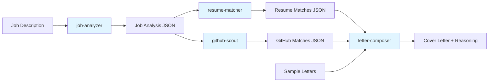

# Cover Letter Generator

Automatically generate tailored job application cover letters by analyzing job descriptions, matching against your resume and GitHub projects, and emulating the style of your previous cover letters.

## Project Overview

This tool generates personalized cover letters that match your authentic writing voice. It analyzes job postings to extract requirements and themes, matches them against your resume and GitHub projects, and composes a cover letter that mirrors the tone, length, and style patterns from your sample letters.

The entire application runs within Claude Code using custom slash commands—no external dependencies or installation required. All intermediate analysis is saved for transparency, so you can review exactly how your qualifications were matched and how the letter was composed.

## How It Works

The generator uses a four-stage pipeline to transform a job posting into a tailored cover letter:



1. **job-analyzer**: Extracts requirements, culture signals, and key themes from the job posting
2. **resume-matcher**: Finds relevant experience and skills from your resume that match the job requirements
3. **github-scout**: Identifies GitHub projects that reinforce your qualifications (optional, requires GitHub username)
4. **letter-composer**: Synthesizes everything into a final cover letter, matching the tone, length, and writing style from your sample letters

All intermediate analysis artifacts (JSON files) are saved to the output directory, giving you full visibility into how the letter was constructed.

## Setup Instructions

**Prerequisites:** Claude Code only—no additional software or dependencies needed.

1. **Configure the tool:**
   - Copy `config.yaml.example` to `config.yaml`
   - Add your GitHub username (optional, but recommended for project matching)

2. **Prepare your inputs:**
   - Add your resume(s) to `inputs/resumes/` folder (you can add multiple versions - the system will consolidate them automatically).
   - Add 2-10 sample cover letters to `inputs/sample_letters/` (the more samples, the better the style matching)
   - Add job descriptions to `inputs/jobs/{company}/job_description.md`

That's it! The tool is ready to use.

## Usage

### Generate a Cover Letter

Run the command with the company name:

```
/generate-cover-letter {company}
```

For example:
```
/generate-cover-letter anthropic
```

The tool will:
- Analyze the job posting
- Match your resume and GitHub projects to the requirements
- Generate a cover letter matching your sample letter style
- Save everything to `outputs/{company}_{YYYY-MM-DD}/`

**Outputs include:**
- `cover_letter.md` - Your generated cover letter
- `reasoning.md` - Explanation of content choices and style matching
- `analysis/` - JSON files with all intermediate analysis (job requirements, resume matches, GitHub matches)

### Refine a Cover Letter

To iterate on a draft without re-analyzing everything:

1. Edit `outputs/{company}_{date}/feedback.md` with your refinement instructions
2. Run the refinement command:
   ```
   /refine-cover-letter {company} {date}
   ```

The tool will regenerate the cover letter using the existing analysis while incorporating your feedback and maintaining the style from your sample letters.

